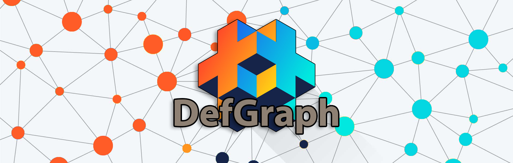
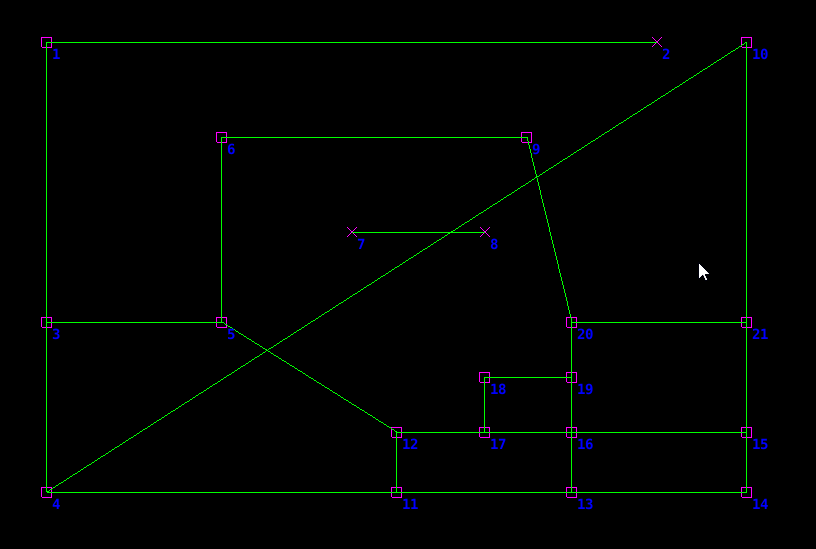
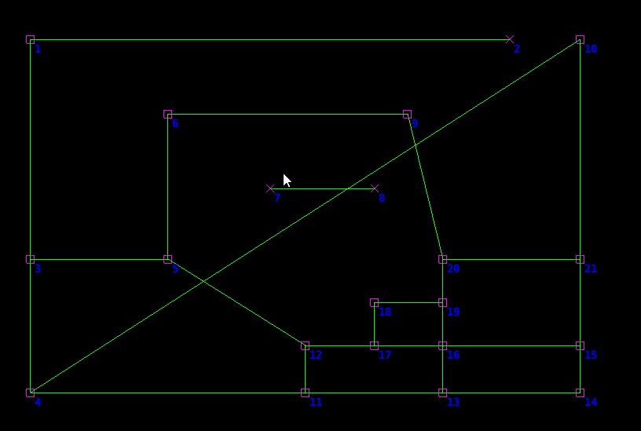

# DefGraph v3  



* <a href="https://github.com/dev-masih/defgraph/blob/master/Migrate_v3.md">**Changelog and migration guild from version 2 to 3**</a>  
* <a href="https://github.com/dev-masih/defgraph/blob/master/Migrate_v2.md">**Changelog and migration guild from version 1 to 2**</a>  

This module contains functions to create a world map as a shape of a graph and the ability to manipulate it at any time, easily see debug drawing of this graph and move go's inside of this graph with utilizing auto pathfinder.  

You can define a graph with several nodes and routes between them and the extension takes care of finding and moving your go inside this graph with just one call inside player update function.  
the gif bellow shows you this exactly when the destination for all red circles is node number 6.  



As you can see staying on the routes is the number one rule for red circles and they are going to the destination with minimum distance. all you have seen in this gif except for red circles, drawn by defGraph module and all of them are customizable.  
defGraph is adaptable to map change so even if you add or remove routes in the middle of the game extension tries to find the better road for you.  



This is a community project you are welcome to contribute to it, sending PR, suggest a feature or report a bug.  

## Installation  
You can use DefGraph in your project by adding this project as a [Defold library dependency](http://www.defold.com/manuals/libraries/). Open your game.project file and in the dependencies field under project add:  

	https://github.com/dev-masih/defgraph/archive/master.zip
  
Once added, you must require the main Lua module via  

```
local defgraph = require("defgraph.defgraph")
```
Then you can use the DefGraph functions using this module.  

## Functions  
These are the list of available functions to use, for better understanding of how this module works, please take a look at project example.  

### map_add_node(position)  
Adding a node at the given position (position.z will get ignored)  
**arguments:** position as vector3  
**return:** Newly added node id as number  

### map_add_route(source_id, destination_id)  
Adding a two-way route between nodes with ids of source_id and destination_id  
**arguments:** source_id as number, destination_id as number  

### map_remove_route(source_id, destination_id)  
Removing an existing route between nodes with ids of source_id and destination_id  
**arguments:** source_id as number, destination_id as number  

### map_update_node_position(node_id, position)  
Updating an existing node position to a new position  
**arguments:** node_id as number, position as vector3  

### move_initialize(source_position, destination_id, threshold, initial_face_vector)  
initialize moves from source_position to a node with an id of destination_id inside the created map and using given threshold and initial_face_vector as game object initial face direction  
**arguments:** source_position as vector3, destination_id as number, threshold as number, initial_face_vector as vector3  
**return:** special movement data as table  
> **Note:** The returned special table consists of combined data to use later in `move_player` and `debug_draw_player_move` functions. If at any time you decided to change the destination of game object you have to call this function and overwrite old movement data with returned one. The value of `threshold` should be higher as go's speed goas up but the minimum value for the `threshold` should be at least 1.  

### move_player(current_position, speed, move_data)  
calculate movements from current_position of the game object inside the created map considering given speed and using last calculated movement data  
**arguments:** current_position as vector3, speed as number, move_data as table  
**return:** new movement data as table, move result table like { `position`: next position of game object as vector3, `rotation`: next rotation of game object as quat, `is_reached`: is game object reached the destination as boolean }  
> **Note:** The returned new movement data should overwrite old movement data. normally this function is placed inside go update function and you can set go position to `position` that is inside move result table. also, you should multiply `dt` with speed yourself before passing it to function.  

### debug_set_properties(node_color, route_color, draw_scale)  
set debug drawing properties  
**arguments:** node_color as vector4, route_color as vector4, draw_scale as number   

### debug_draw_map_nodes(is_show_ids)  
debug draw all map nodes and choose to show node ids or not  
**arguments:** is_show_ids as boolean  

### debug_draw_map_routes()  
debug draw all map routes  

### debug_draw_player_move(movement_data, color)
debug draw player route to destination with given color  
**arguments:** movement_data as table, color as vector4    
