# DefGraph v4  


* <a href="https://github.com/dev-masih/defgraph/blob/master/Migrate_v3.md">**Changelog and migration guild from version 2 to 3**</a>  
* <a href="https://github.com/dev-masih/defgraph/blob/master/Migrate_v2.md">**Changelog and migration guild from version 1 to 2**</a>  

This module contains functions to create a world map as a shape of a graph and the ability to manipulate it at any time, easily see debug drawing of this graph and move go's inside of this graph with utilizing auto pathfinder.  

You can define a graph with several nodes and routes between them and the extension takes care of finding and moving your go inside this graph with just one call inside player update function.  
the gif bellow shows you this exactly when the destination for all red circles is node number 6.  

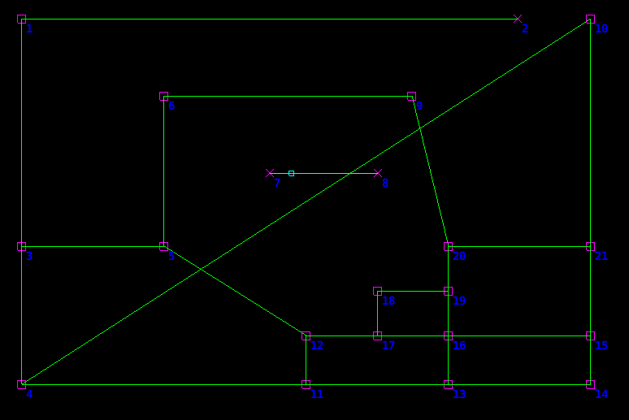

As you can see staying on the routes is the number one rule for red circles and they are going to the destination with minimum distance. all you have seen in this gif except for red circles, drawn by defGraph module and all of them are customizable.  
defGraph is adaptable to map change so even if you add or remove routes in the middle of the game extension tries to find the better road for you.  
also, you can update nodes positions, another word you can have dynamically moving routes ;)


This is a community project you are welcome to contribute to it, sending PR, suggest a feature or report a bug.  

## Installation  
You can use DefGraph in your project by adding this project as a [Defold library dependency](http://www.defold.com/manuals/libraries/). Open your game.project file and in the dependencies field under project add:  

	https://github.com/dev-masih/defgraph/archive/master.zip
  
Once added, you must require the main Lua module via  

```
local defgraph = require("defgraph.defgraph")
```
Then you can use the DefGraph functions using this module.  

[Official Defold game asset page for DefGraph](https://defold.com/assets/defgraph/)

## Module Settings  
There are several parameters for the module to works with, you can change these parameters one time for the entire module with `map_set_properties` and let each game object inherit those or set these parameters or each game object with `move_initialize` function. If you choose to not change any of them, the module uses it's own default values.  
#### **Threshold:**  
This `number` value used as detection that an object is on a route or not. It's better to use a bigger value as object speed is getting higher to have better movement experience. The module default value is `1` and minimum for this value should be `1`.  
#### **Path Curve Tightness:**  
This `number` value determines how tight a turn on the path should be. The module default value is `4` and minimum for this value should be `2`.  

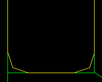 | 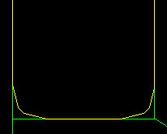 | 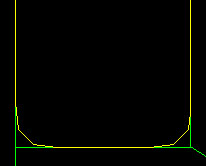
:-------------: | :-------------: | :-------------:
Tightness: 2 | Tightness: 3 | Tightness: 8  

#### **Path Curve Roundness:**  
This `number` value determines how round a turn on a path should be. The module default value is `3`. If this value equals `0` the path will not have any curve and the value of `settings_path_curve_tightness` and `settings_path_curve_max_distance_from_corner` will get ignored. The higher value for roundness will need more processing power especially when your map nodes are dynamically moving.  

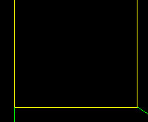 | 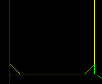 | 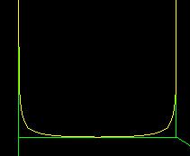
:-------------: | :-------------: | :-------------:
Roundness: 0 | Roundness: 1 | Roundness: 5  

#### **Path Curve Max Distance From Corner:**  
This `number` value determines the maximum value of a turn distance to a corner. The module default value is `10`. If this value equals `0` the path will not have any curve but you should set `settings_path_curve_roundness` to `0` if this is what you want.  

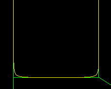 | 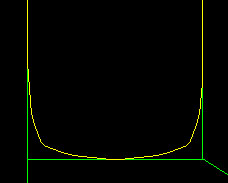 | 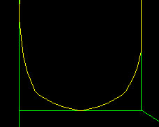
:-------------: | :-------------: | :-------------:
Max: 10 | Max: 30 | Max: 50  

#### **Allow Enter on Route:**  
This `boolean` value determines is a game object can enter a map in the middle of a route or is should enter it from corners only. The module default value is `true`.  

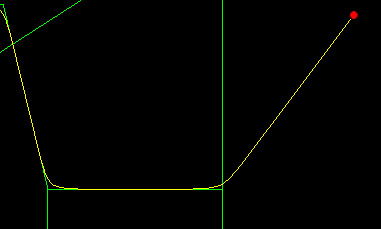 | 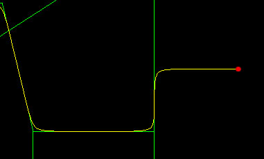
:-------------: | :-------------:
False | True  

## Functions  
These are the list of available functions to use, for better understanding of how this module works, please take a look at project example.  

---  
### map_set_properties([settings_go_threshold], [settings_path_curve_tightness], [settings_path_curve_roundness], [settings_path_curve_max_distance_from_corner], [settings_allow_enter_on_route])  
Set the main path and move calculation properties, nil inputs will fall back to module default values. These values will overwrite default module values.  
#### **arguments:**  
* `optional number` settings_go_threshold `[default = 1]`  
* `optional number` settings_path_curve_tightness `[default = 4]`  
* `optional number` settings_path_curve_roundness `[default = 3]`  
* `optional number` settings_path_curve_max_distance_from_corner `[default = 10]`  
* `optional boolean` settings_allow_enter_on_route `[default = true]`  
---
### map_add_node(position)  
Adding a node at the given position (position.z will get ignored).  
#### **arguments:**  
* `vector3` position  
#### **return:**  
* `number` Newly added node id  

> **Note:** Single nodes with no route attached to them are not participating in any routing calculations and it's better to remove them if you are not using them.  
---  
### map_add_route(source_id, destination_id, is_one_way)  
Adding a two-way route between two nodes, you can set it as one way or two way.  
#### **arguments:**  
* `number` source_id  
* `number` destination_id  
* `optional boolean` is_one_way `[false]`  

> **Note:** If you never need to get pathfinding result in two way it's better to use a one-way path because it will be a bit computationally lighter.  
---  
### map_remove_route(source_id, destination_id, is_remove_one_way)  
Removing an existing route between two nodes, you can set it to remove just one way or both ways.  
#### **arguments:**  
* `number` source_id  
* `number` destination_id  
* `optional boolean` is_remove_one_way `[false]`  
---  
### map_remove_node(node_id)  
Removing an existing node, attached routes to this node will remove.  
#### **arguments:**  
* `number` node_id   
---  
### map_update_node_position(node_id, position)  
Update an existing node position.  
#### **arguments:**  
* `number` node_id  
* `vector3` position  
---  
### move_initialize(source_position, destination_id, initial_face_vector, settings_go_threshold, settings_path_curve_tightness, settings_path_curve_roundness, settings_path_curve_max_distance_from_corner, settings_allow_enter_on_route)  
Initialize moves from a source position to destination node inside the created map and using given threshold and initial face vector as game object initial face direction and path calculate settings, **the optional value will fall back to module default values.**    
#### **arguments:**  
* `vector3` source_position  
* `number` destination_id
* `optional vecotr3` initial_face_vector
* `optional number` settings_go_threshold
* `optional number` settings_path_curve_tightness
* `optional number` settings_path_curve_roundness
* `optional number` settings_path_curve_max_distance_from_corner
* `optional boolean` settings_allow_enter_on_route  
#### **return:**  
* `table` special movement data  
> **Note:** The returned special table consists of combined data to use later in `move_player` and `debug_draw_player_move` functions. If at any time you decided to change the destination of game object you have to call this function and overwrite old movement data with returned one.  
---  
### move_player(current_position, speed, move_data)  
Calculate movements from current position of the game object inside the created map considering given speed, using last calculated movement data.  
#### **arguments:**  
* `vector3` current_position
* `number` speed
* `table` move_data  
#### **return:**  
* `table` new movement data
* `table` move result
  * `position`: `vector3` next position of game object
  * `rotation`: `quat` next rotation of game object
  * `is_reached`: `boolean` is game object reached the destination  
> **Note:** The returned new movement data should overwrite old movement data. normally this function is placed inside go update function and you can set go position to `position` and rotation to `rotation` that is inside move result table. also, you should multiply `dt` with speed yourself before passing it to function.  
---  
### debug_set_properties(node_color, two_way_route_color, one_way_route_color, draw_scale)  
set debug drawing properties  
#### **arguments:**  
* `optional vector4` node_color `[vector4(1, 0, 1, 1)]`
* `optional vector4` two_way_route_color `[vector4(0, 1, 0, 1)]`
* `optional vector4` one_way_route_color `[vector4(0, 1, 1, 1)]`
* `optional number` draw_scale `[5]`  
---  
### debug_draw_map_nodes(is_show_ids)  
Debug draw all map nodes and choose to show node ids or not.  
#### **arguments:**  
* `optional boolean` is_show_ids `[false]`   
---  
### debug_draw_map_routes()  
Debug draw all map routes.  

---  
### debug_draw_player_move(movement_data, color, is_show_intersection)
Debug draw player specific path with given color.  
#### **arguments:**  
* `table` movement_data
* `vector4` color
* `optional boolean` is_show_intersection `[false]` 
---  

## Donations  
If you really like this extension and want to support me, consider donating to me with BTC or ETH. All donations are optional and are greatly appreciated 🙏.  

BTC: 1EdDfXRuqnb5a8RmtT7ZnjGBcYeNzXLM3e  
ETH: 0x99d3D5816e79bCfB2aE30d1e02f889C40800F141  
  
## License  
DefGraph is released under the MIT License. See the [bundled LICENSE](https://github.com/dev-masih/defgraph/blob/master/LICENSE) file for details.  
